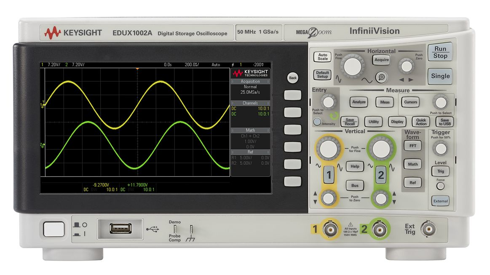

# Oscilloscope Studio for Keysight InfiniiVision 1000 X-Series

Oscilloscope Studio is a graphical application for controlling Keysight InfiniiVision 1000 X-Series oscilloscopes and automating data acquisition.

## Run the application

The launchers install `uv`, Python 3.12, and the project dependencies into the repository on first use. Internet access is required for the initial setup.

### Linux

```bash
bash Linux_Oscilloscope_Studio.sh
# Or
./Linux_Oscilloscope_Studio.sh
```

### macOS

```bash
bash Mac_Oscilloscope_Studio.command
# Or
./Mac_Oscilloscope_Studio.command
```

If macOS blocks a downloaded launcher, enable it with:

```bash
xattr -dr com.apple.quarantine .
chmod +x Mac_Oscilloscope_Studio.command
```

### Windows

Double-click `Windows_Oscilloscope_Studio.bat`, or run it from Command Prompt.

## Compatibility

The application is intended to support the entire InfiniiVision 1000 X-Series. At present, however, it has only been tested with the Keysight EDUX1002A shown below. Compatibility with other models has not yet been verified.

<p align="center">
  
  <br>
  <sub>Image source: <a href="https://www.keysight.com/us/en/support/EDUX1002A/oscilloscope-50-mhz-2-analog-channels.html#drivers">official Keysight EDUX1002A product page</a>.</sub>
</p>

## Communication protocol

All instrument communication implemented in this project is based on the command set documented in the official [Keysight InfiniiVision 1000 X-Series Programmer's Guide](https://www.keysight.com/us/en/assets/9018-07554/programming-guides/9018-07554.pdf).

## Disclaimer

Oscilloscope Studio is an independent project and is not an official Keysight product. It is neither affiliated with nor endorsed by Keysight Technologies. The application was developed to meet our laboratory's internal need for automated data acquisition.

## Developers

### Developer execution

With `uv` already installed:

```bash
cd app
uv run python main.py
```

### Releases and updates

Updates are distributed through GitHub Releases. To publish a release, run the platform launcher with the `release` argument. The workflow requires Git, push access to the repository, and the GitHub CLI (`gh`).

```bash
./Linux_Oscilloscope_Studio.sh release
./Mac_Oscilloscope_Studio.command release
```

On Windows:

```bat
Windows_Oscilloscope_Studio.bat release
```
